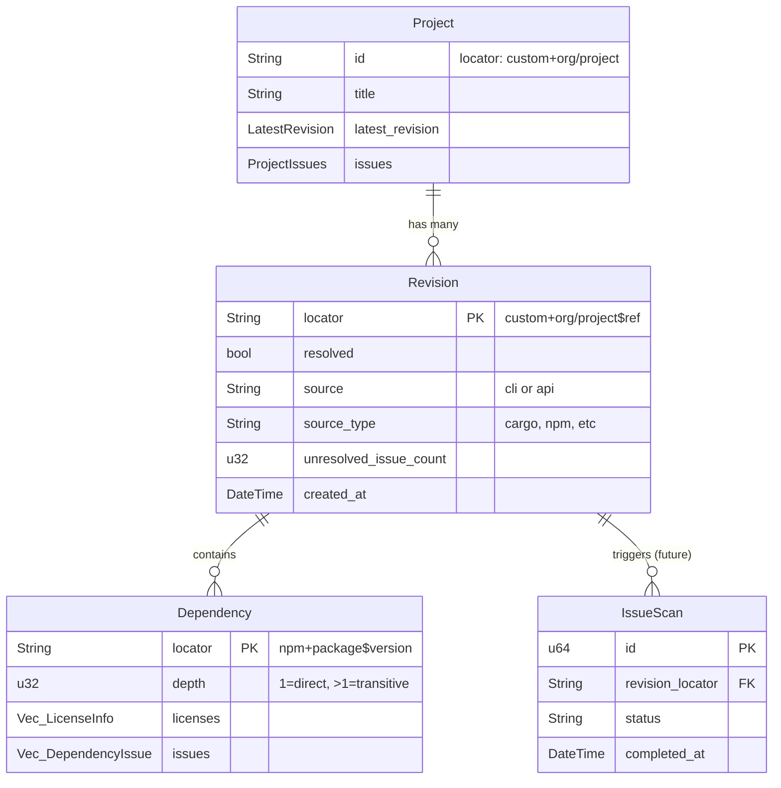

# fossapi - FOSSA API Rust Client

Rust library wrapping the FOSSA API with trait-based architecture.

## Entity Relationship Diagram



## Architecture

```
Project (top-level container)
├── latest_revision: LatestRevision
│   └── locator → can fetch full Revision
└── revisions() → Vec<Revision>
    └── revision.dependencies() → Vec<Dependency>
```

## API Endpoints

| Entity | Endpoint | Notes |
|--------|----------|-------|
| Projects | `GET /v2/projects` | Paginated listing |
| Project | `GET /projects/{locator}` | Single project |
| Revisions | `GET /projects/{locator}/revisions` | Grouped by branch |
| Dependencies | `GET /v2/revisions/{locator}/dependencies` | For a revision |

## Traits

| Trait | Purpose | Example |
|-------|---------|---------|
| `Get` | Fetch single entity | `Project::get(&client, locator)` |
| `List` | Paginated listing | `Project::list_page(&client, query, page, count)` |
| `Update` | Modify entity | `Project::update(&client, locator, params)` |

## Models

- **Project** - Top-level container, implements Get/List/Update
- **Revision** - Snapshot at point in time, implements Get/List
- **Dependency** - Package dependency, implements List only (via revision)
- **LicenseInfo** - Can be simple string ("MIT") or full object

## Future Work

- **IssueScan** - Issue scans tied to revisions (not yet implemented)
