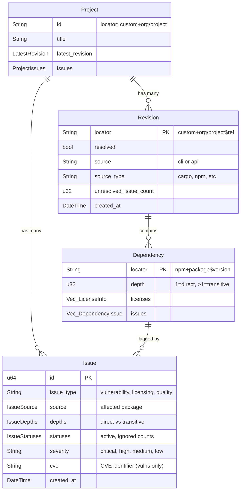

# fossapi - FOSSA API Rust Client

Rust library wrapping the FOSSA API with trait-based architecture.

## Development

### Build & Test

```bash
cargo build
cargo test
cargo clippy
```

## Pull Request Workflow

### Creating a PR

1. Create feature branch: `git checkout -b feature/my-feature`
2. Make changes and commit
3. Push and create PR:

```bash
gh pr create --title "Title" --body "$(cat <<'EOF'
## Summary
Brief description of changes

## Test plan
How the changes were tested
EOF
)"
```

## Entity Relationship Diagram



## Architecture

```
Project (top-level container)
├── latest_revision: LatestRevision
│   └── locator → can fetch full Revision
├── revisions() → Vec<Revision>
│   └── revision.dependencies() → Vec<Dependency>
└── get_project_issues() → Vec<Issue>
    └── Issues across all revisions/dependencies
```

## API Endpoints

| Entity | Endpoint | Notes |
|--------|----------|-------|
| Projects | `GET /v2/projects` | Paginated listing |
| Project | `GET /projects/{locator}` | Single project |
| Revisions | `GET /projects/{locator}/revisions` | Grouped by branch |
| Dependencies | `GET /v2/revisions/{locator}/dependencies` | For a revision |
| Issues | `GET /v2/issues` | Paginated, filterable by category/project |
| Issue | `GET /v2/issues/{id}` | Single issue with full details |

## Traits

| Trait | Purpose | Example |
|-------|---------|---------|
| `Get` | Fetch single entity | `Project::get(&client, locator)` |
| `List` | Paginated listing | `Project::list_page(&client, query, page, count)` |
| `Update` | Modify entity | `Project::update(&client, locator, params)` |

## Models

- **Project** - Top-level container, implements Get/List/Update
- **Revision** - Snapshot at point in time, implements Get/List
- **Dependency** - Package dependency, implements List only (via revision)
- **Issue** - Vulnerability/licensing/quality issue, implements Get/List
- **LicenseInfo** - Can be simple string ("MIT") or full object

## Issue Categories

Issues come in three categories with different fields:

| Category | Key Fields | Description |
|----------|------------|-------------|
| `vulnerability` | cve, cvss, severity, remediation, epss | Security vulnerabilities |
| `licensing` | license | License compliance issues |
| `quality` | qualityRule | Code quality concerns |

## Future Work

- **IssueScan** - Issue scans tied to revisions (not yet implemented)

## Nudge

This project uses [Nudge](https://github.com/attunehq/nudge), a collaborative partner that helps you remember coding conventions. Nudge watches your `Write` and `Edit` operations and reminds you about patterns and preferences that matter here—so you can focus on the actual problem instead of tracking stylistic details.

**Nudge is on your side.** When it sends you a message, it's not a reprimand—it's a colleague tapping you on the shoulder. The messages are direct (sometimes blunt) because that's what cuts through when you're focused. Trust the feedback and adjust; if a rule feels wrong, mention it so we can fix the rule.

**Writing new rules:** If the user asks you to add or modify Nudge rules, run `nudge claude docs` to see the rule format, template variables, and guidelines for writing effective messages.
