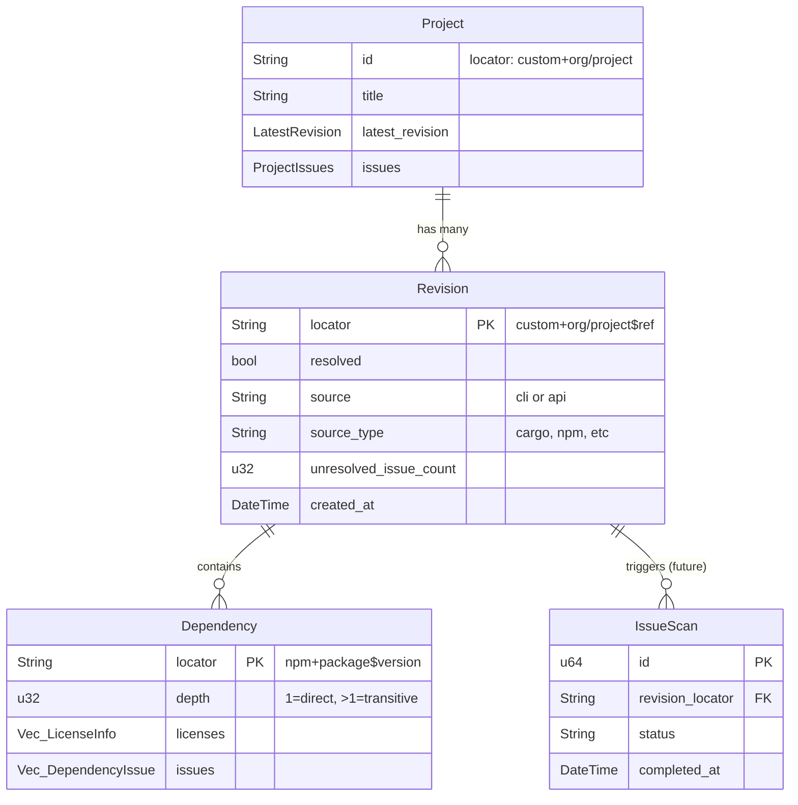

# fossapi - FOSSA API Rust Client

## Eliza

**IMPORTANT**: Interact with this project through `eliza` commands, not raw git/cargo.

### Repository Commands

```bash
eliza repo status                            # Check git status
eliza repo pull                              # Pull latest changes
eliza repo checkout --branch <name>          # Switch branches
eliza repo feature create --name <feature>   # Create feature branch
```

### Build Scripts

```bash
eliza repo script build                      # Build the project
eliza repo script test                       # Run tests
eliza repo script lint                       # Run lints
```

Run `eliza repo script --list` to see available scripts for this project.

Rust library wrapping the FOSSA API with trait-based architecture.

## Project Management (eliza)

Use `eliza` for all project operations. Always use `-y` (skip confirmations) and `--json` when scripting.

```bash
# Repository
eliza repo status                              # Git status
eliza repo feature start <name> --iss ISS-XX   # Start feature branch
eliza repo feature submit --body "Description" # Submit PR
eliza repo script build|test|lint              # Run scripts

# DevRev (issues/enhancements)
eliza devrev list issues --part FEAT-XX        # Issues under a part
eliza devrev view ISS-XX                       # View issue details
eliza devrev create issue -y --title "..." --part FEAT-XX
eliza devrev update ISS-XX --stage in_progress
eliza devrev comment ISS-XX "Notes..."
eliza devrev link ISS-XX ENH-YY                # Link issue → enhancement
```

**Parts hierarchy:** PROD (product) → CAPL (capability) → FEAT (feature) → ENH (enhancement) / ISS (issue)

## Entity Relationship Diagram



## Architecture

```
Project (top-level container)
├── latest_revision: LatestRevision
│   └── locator → can fetch full Revision
└── revisions() → Vec<Revision>
    └── revision.dependencies() → Vec<Dependency>
```

## API Endpoints

| Entity | Endpoint | Notes |
|--------|----------|-------|
| Projects | `GET /v2/projects` | Paginated listing |
| Project | `GET /projects/{locator}` | Single project |
| Revisions | `GET /projects/{locator}/revisions` | Grouped by branch |
| Dependencies | `GET /v2/revisions/{locator}/dependencies` | For a revision |

## Traits

| Trait | Purpose | Example |
|-------|---------|---------|
| `Get` | Fetch single entity | `Project::get(&client, locator)` |
| `List` | Paginated listing | `Project::list_page(&client, query, page, count)` |
| `Update` | Modify entity | `Project::update(&client, locator, params)` |

## Models

- **Project** - Top-level container, implements Get/List/Update
- **Revision** - Snapshot at point in time, implements Get/List
- **Dependency** - Package dependency, implements List only (via revision)
- **LicenseInfo** - Can be simple string ("MIT") or full object

## Future Work

- **IssueScan** - Issue scans tied to revisions (not yet implemented)

## Nudge

This project uses [Nudge](https://github.com/attunehq/nudge), a collaborative partner that helps you remember coding conventions. Nudge watches your `Write` and `Edit` operations and reminds you about patterns and preferences that matter here—so you can focus on the actual problem instead of tracking stylistic details.

**Nudge is on your side.** When it sends you a message, it's not a reprimand—it's a colleague tapping you on the shoulder. The messages are direct (sometimes blunt) because that's what cuts through when you're focused. Trust the feedback and adjust; if a rule feels wrong, mention it so we can fix the rule.

**Writing new rules:** If the user asks you to add or modify Nudge rules, run `nudge claude docs` to see the rule format, template variables, and guidelines for writing effective messages.
